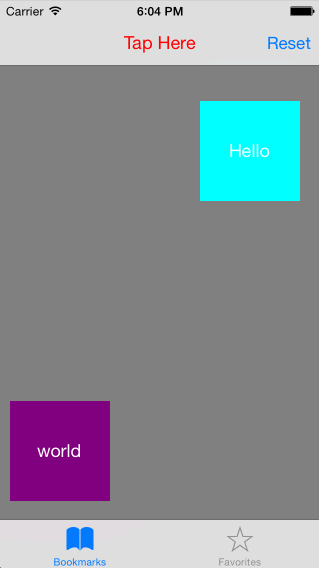

DXPopover
=========

A Popover mimic Facebook  app popover using UIKit.

The concept of this popover is very simple: add your contentView in a popover, then show the popover in the container view.

##Screenshot

##Usage

The API and demo is fairly straight forward. You can read details in the demo.

##Showing the popover

1. make a your contentView, set its frame or bounds.
2. new a DXPopover.
3. show it.

##### Simple
eg:

    UIImageView *imageV= [[UIImageView alloc] initWithFrame:CGRectMake(0, 0, 200, 200)];
    imageV.image = [UIImage imageNamed:@"ig20.jpg"];
    DXPopover *popover = [DXPopover popover];
    [popover showAtView:self.btn1 withContentView:imageV];

##### More conceret
eg:

    [self.popover showAtPoint:yourPoint popoverPostion:DXPopoverPositionDown withContentView:self.tableView inView:self.tabBarController.view]; // 1.Set the show point 2.set The position if up or down staying the showPoint, 3.Your contentView 4.The containerView
    __weak typeof(self)weakSelf = self;
    self.popover.didDismissHandler = ^{ //The callback of popover dimissal.
        [weakSelf bounceTargetView:titleView];
    };

